# Diagrama de Clases - RockyCats Game

Este archivo contiene el código Mermaid del diagrama de clases completo del proyecto.

## Cómo usar este diagrama:

### Opción 1: Mermaid Live Editor
1. Ve a https://mermaid.live/
2. Copia y pega el código de abajo
3. Descarga como PNG, SVG o PDF

### Opción 2: Visual Studio Code
1. Instala la extensión "Markdown Preview Mermaid Support"
2. Abre este archivo en VS Code
3. Presiona `Ctrl+Shift+V` para ver el preview
4. Click derecho → "Export to..."

### Opción 3: GitHub/GitLab
- GitHub y GitLab renderizan automáticamente diagramas Mermaid en archivos .md

---

## Código del Diagrama:

```mermaid
classDiagram
    %% Clases base de Unity y Photon
    class MonoBehaviour {
        <<Unity>>
    }
    
    class MonoBehaviourPun {
        <<Photon>>
        +PhotonView photonView
    }
    
    class MonoBehaviourPunCallbacks {
        <<Photon>>
        +OnConnectedToMaster()
        +OnJoinedRoom()
        +OnPlayerEnteredRoom()
    }
    
    %% Herencias base
    MonoBehaviour <|-- MonoBehaviourPun
    MonoBehaviourPun <|-- MonoBehaviourPunCallbacks
    
    %% ===== PLAYER SYSTEM =====
    class PlayerController {
        -CharacterController controller
        -PhaseManager phaseManager
        -PhotonView PV
        -Vector3 horizontalVelocity
        -float verticalVelocity
        -bool isGrounded
        +SetMovementMode(mode)
        +SetSpawnPoint(pos)
        +Jump()
        +PerformWallJump()
    }
    
    class PlayerManager {
        -PhotonView PV
        +CreateController()
        -GetSpawnPosition()
    }
    
    class PlayerInventory {
        -int water
        -int temperature
        -int pressure
        -int time
        -PhotonView photonView
        +AddResource(type, amount)
        +GetResource(type)
        +OpenInventory()
    }
    
    class PlayerPhase {
        <<abstract>>
        #float moveSpeedOverride
        #float jumpForceOverride
        #PlayerController playerController
        +Initialize(controller)*
        +ApplyPhaseStats()*
        +HandleAbility()*
        +HandleWallSlide()*
        +UpdatePhase()*
    }
    
    class MagmaPhase {
        -float currentCharge
        -bool isCharging
        +HandleAbility()
        +HandleWallSlide()
        +ReleaseHeat()
    }
    
    class IgneousPhase {
        -float dashForce
        -bool isDashing
        -bool canDash
        +HandleAbility()
        +Dash()
    }
    
    class SedimentPhase {
        +HandleAbility()
    }
    
    class PhaseManager {
        -PlayerPhase[] availablePhases
        -PlayerPhase currentPhase
        -PlayerController playerController
        -int currentPhaseIndex
        +SwitchToPhase(index)
        +GetCurrentPhase()
        +UpdatePlayerMaterial()
    }
    
    MonoBehaviour <|-- PlayerController
    MonoBehaviour <|-- PlayerManager
    MonoBehaviour <|-- PlayerInventory
    MonoBehaviour <|-- PlayerPhase
    MonoBehaviour <|-- PhaseManager
    
    PlayerPhase <|-- MagmaPhase
    PlayerPhase <|-- IgneousPhase
    PlayerPhase <|-- SedimentPhase
    
    PlayerController --> PhaseManager : uses
    PlayerController --> CharacterController : has
    PhaseManager --> PlayerPhase : manages
    PhaseManager --> PlayerController : controls
    PlayerPhase --> PlayerController : modifies
    
    %% ===== NETWORKING =====
    class Launcher {
        -TMP_InputField roomNameInputField
        -Transform roomListContent
        -Transform playerListContent
        +CreateRoom()
        +JoinRoom(info)
        +StartGame()
        +LeaveRoom()
    }
    
    class RoomManager {
        +static Instance
        +OnSceneLoaded()
    }
    
    MonoBehaviourPunCallbacks <|-- Launcher
    MonoBehaviourPunCallbacks <|-- RoomManager
    
    %% ===== LEVEL MANAGERS =====
    class Level1Manager {
        +static Instance
        -int gizmoTemperature
        -int chiliTemperature
        -HUDElement[] hudElements
        +UpdateTemperatureDisplays()
        +ShowHUD(name)
        +HideHUD(name)
    }
    
    class Level2Manager {
        +static Instance
        -TextMeshProUGUI roundText
        -TextMeshProUGUI statusText
        -Image energyBarFill
        +OnBeginRound()
        +OnRoundSuccess()
        +OnPuzzleCompleted()
    }
    
    class LevelManager {
        +WaveManager waveManager
        -bool wavedStarted
        +LaunchWaves()
    }
    
    MonoBehaviourPun <|-- Level1Manager
    MonoBehaviourPun <|-- Level2Manager
    MonoBehaviour <|-- LevelManager
    
    %% ===== UI SYSTEM =====
    class MenuManager {
        +static Instance
        -Menu[] menus
        +OpenMenu(name)
        +CloseMenu(menu)
    }
    
    class Menu {
        +string menuName
        +bool open
        +Open()
        +Close()
    }
    
    class HUDManager {
        +static Instance
        -HUDElement[] hudElements
        -bool isPaused
        +ShowHUD(name)
        +HideHUD(name)
        +TogglePause()
    }
    
    class HUDElement {
        +string hudName
        +GameObject hudObject
        +Show()
        +Hide()
    }
    
    MonoBehaviour <|-- MenuManager
    MonoBehaviour <|-- Menu
    MonoBehaviour <|-- HUDManager
    MonoBehaviour <|-- HUDElement
    
    MenuManager --> Menu : manages
    HUDManager --> HUDElement : manages
    
    %% ===== CAMERA SYSTEM =====
    class AssignCameraTarget {
        +Start()
    }
    
    class CameraTrigger {
        -Vector3 targetRotation
        -CinemachineVirtualCamera virtualCam
        +OnTriggerEnter()
        +RotateVirtualCamera()
    }
    
    MonoBehaviour <|-- AssignCameraTarget
    MonoBehaviour <|-- CameraTrigger
    
    %% ===== INTERACTABLES =====
    class IIgneousInteractable {
        <<interface>>
        +OnIgneousCollision()*
    }
    
    class Heatable {
        <<abstract>>
        #float maxHeat
        #float currentHeat
        +ReceiveHeat(amount)*
        #OnFullyHeated()*
    }
    
    class IgneousBreakableWall {
        +OnIgneousCollision()
    }
    
    class ExampleMeltableObject {
        +ReceiveHeat(amount)
        #OnFullyHeated()
    }
    
    MonoBehaviourPun <|-- Heatable
    Heatable <|-- ExampleMeltableObject
    IIgneousInteractable <|.. IgneousBreakableWall
    
    IgneousPhase ..> IIgneousInteractable : interacts
    MagmaPhase ..> Heatable : heats
    
    %% ===== PICKUPS & OBSTACLES =====
    class Pickup {
        <<enumeration>> PickupType
        -PickupType type
        -int value
        +OnTriggerEnter()
        -ApplyEffect(player)
    }
    
    class Obstacle {
        <<enumeration>> ObstacleType
        +ObstacleType obstacleType
        +int temperatureChange
        +OnTriggerEnter()
    }
    
    class ObstacleMovement {
        +float speed
        +float distance
        +Update()
    }
    
    MonoBehaviour <|-- Pickup
    MonoBehaviour <|-- Obstacle
    MonoBehaviour <|-- ObstacleMovement
    
    Pickup ..> PlayerInventory : adds resources
    Obstacle ..> Level1Manager : updates temp

    %% ===== LEVEL 2 PUZZLE =====
    class GasSequenceManager {
        -GasSequenceConfig config
        -GasCraterController[] craters
        -int currentRound
        +StartPuzzle()
        +CheckInput(buttonId)
    }

    class GasCraterController {
        -int craterId
        -Material activeMaterial
        +ActivateCrater()
        +DeactivateCrater()
    }

    class GasSequenceConfig {
        +int totalRounds
        +float displayDelay
        +float inputTimeout
    }

    class Level2PuzzleStartTrigger {
        -GasSequenceManager sequenceManager
        +OnTriggerEnter()
    }

    class PuzzleButtonInput {
        -int buttonId
        -GasSequenceManager sequenceManager
        +OnInteract()
    }

    MonoBehaviourPun <|-- GasSequenceManager
    MonoBehaviour <|-- GasCraterController
    MonoBehaviour <|-- Level2PuzzleStartTrigger
    MonoBehaviour <|-- PuzzleButtonInput

    GasSequenceManager --> GasCraterController : controls
    GasSequenceManager --> GasSequenceConfig : uses
    GasSequenceManager --> Level2Manager : updates UI
    Level2PuzzleStartTrigger --> GasSequenceManager : triggers
    PuzzleButtonInput --> GasSequenceManager : sends input

    %% ===== LEVEL 3 BOSS =====
    class WavesManager {
        -RadialShotWeapon[] weapons
        -BulletPool bulletPool
        +StartWaves()
        +SpawnWave()
    }

    class RadialShotWeapon {
        -RadialShotPattern pattern
        -BulletPool bulletPool
        +Shoot()
    }

    class RadialShotPattern {
        +int bulletCount
        +float spreadAngle
        +float bulletSpeed
    }

    class BulletPool {
        -GameObject bulletPrefab
        -Queue~GameObject~ pool
        +GetBullet()
        +ReturnBullet(bullet)
    }

    class Bullet {
        -float speed
        -float lifetime
        +Initialize(direction)
        +OnTriggerEnter()
    }

    MonoBehaviour <|-- WavesManager
    MonoBehaviour <|-- RadialShotWeapon
    MonoBehaviour <|-- BulletPool
    MonoBehaviour <|-- Bullet

    LevelManager --> WavesManager : starts
    WavesManager --> RadialShotWeapon : manages
    RadialShotWeapon --> RadialShotPattern : uses
    RadialShotWeapon --> BulletPool : requests bullets
    BulletPool --> Bullet : pools

    %% ===== API SYSTEM =====
    class APIRequests {
        -string serverUrl
        +GetPlayerByUsername(username)
        +LoginUser(request, onSuccess, onError)
        +CreateUser(newUser, onSuccess, onError)
    }

    class PlayerObj {
        +string _id
        +string username
        +string password
        +string email
        +int levels
        +int[] scores
    }

    class LoginRequest {
        +string username
        +string password
    }

    class LoginResponse {
        +bool success
        +string token
        +PlayerObj player
    }

    class Login {
        -APIRequests apiRequests
        +OnLoginButtonClick()
    }

    class CreateUser {
        -APIRequests apiRequests
        +OnCreateUserButtonClick()
    }

    MonoBehaviour <|-- Login
    MonoBehaviour <|-- CreateUser

    APIRequests --> PlayerObj : returns
    APIRequests --> LoginResponse : returns
    Login --> APIRequests : uses
    CreateUser --> APIRequests : uses
    LoginResponse --> PlayerObj : contains

    %% ===== CHECKPOINT SYSTEM =====
    class Checkpoint {
        +OnTriggerEnter()
    }

    MonoBehaviour <|-- Checkpoint
    Checkpoint ..> PlayerController : sets spawn
```

---

## Resumen de Sistemas

### 🎮 Sistema de Jugador
- **PlayerController**: Control de movimiento, física y animaciones
- **PhaseManager**: Gestión de transformaciones (Magma, Igneous, Sediment)
- **PlayerInventory**: Sistema de recursos y crafting

### 🌐 Sistema de Networking
- **Launcher**: Lobby y gestión de salas
- **RoomManager**: Persistencia entre escenas

### 🎯 Gestores de Niveles
- **Level1Manager**: Mecánicas de temperatura
- **Level2Manager**: Puzzle de secuencias de gas
- **LevelManager**: Boss fight y oleadas

### 🖥️ Sistema de UI
- **MenuManager**: Navegación de menús
- **HUDManager**: Elementos in-game

### 🔐 Sistema de API
- **APIRequests**: Comunicación con backend
- **Login/CreateUser**: Autenticación de usuarios

### 🧩 Interactuables
- **Heatable**: Objetos que reaccionan al calor (MagmaPhase)
- **IIgneousInteractable**: Objetos rompibles con dash (IgneousPhase)

---

## Patrones de Diseño Utilizados

1. **Singleton**: Managers de nivel y UI
2. **Strategy Pattern**: Sistema de fases del jugador
3. **Object Pool**: Pool de balas para optimización
4. **Observer**: Callbacks de Photon
5. **Component Pattern**: Arquitectura de Unity

---

## Herramientas para Visualizar

### 🌐 Mermaid Live Editor (Recomendado)
1. Ve a: https://mermaid.live/
2. Copia el código del diagrama
3. Descarga como PNG, SVG o PDF

### 💻 Visual Studio Code
1. Instala: "Markdown Preview Mermaid Support"
2. Abre este archivo
3. `Ctrl+Shift+V` para preview
4. Click derecho → Export

### 📱 Otras herramientas
- **Draw.io**: Importa código Mermaid
- **GitHub/GitLab**: Renderiza automáticamente
- **Notion**: Soporta bloques Mermaid
- **Obsidian**: Plugin de Mermaid

---

## Notas Adicionales

- Todas las clases de jugador heredan de `MonoBehaviour` (Unity)
- Las clases de networking heredan de `MonoBehaviourPun` o `MonoBehaviourPunCallbacks` (Photon)
- El proyecto usa **Photon PUN 2** para multijugador
- **Cinemachine** para sistema de cámaras
- **TextMeshPro** para UI de texto

---

**Última actualización**: 2025-11-06
**Versión del proyecto**: Unity 2022.3.62f3
